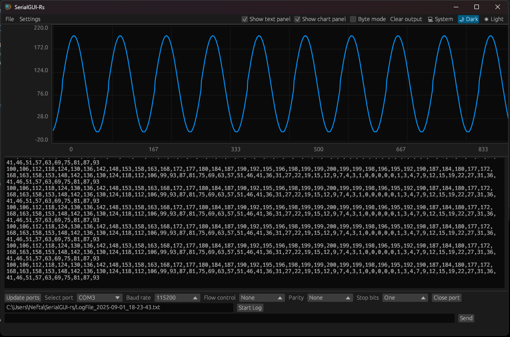

# SerialGUI-Rs

A lightweight serial terminal monitor written in Rust

**SerialGUI-Rs** is a cross-platform graphical serial monitor application that uses the [**serialport-rs**](https://github.com/serialport/serialport-rs) library as its backend and [**eframe**](https://github.com/emilk/egui/tree/master/crates/eframe) for the graphical interface.



## Features

- Real-time serial port monitoring.
- Cross-platform support (Windows, macOS, Linux).
- Intuitive and user-friendly graphical interface.
- Configuration of serial communication parameters (baud rate, parity, etc.).

## Installation

Download the latest release for your platform from the [Releases page](https://github.com/Opentronika/SerialGUI-rs/releases/latest):

### Linux

- **x86_64 (Intel/AMD 64-bit):**
  - File: `SerialGUI_rs-Linux-x64.AppImage`
  - The SHA256 hash is available on the download page.

- **ARM64 (Raspberry Pi, etc):**
  - File: `SerialGUI_rs-Linux-arm64.AppImage`
  - The SHA256 hash is available on the download page.

**To run the AppImage:**
```sh
chmod +x SerialGUI_rs-*.AppImage
./SerialGUI_rs-*.AppImage
```

---

### macOS

- **Apple Silicon (ARM64):**
  - File: `SerialGUI_rs-MacOS-arm64.dmg`
  - The SHA256 hash is available on the download page.

- **Intel (x64):**
  - File: `SerialGUI_rs-MacOS-x64.dmg`
  - The SHA256 hash is available on the download page.

**To install:**
1. Download the `.dmg` file for your architecture from the [latest release](https://github.com/Opentronika/SerialGUI-rs/releases/latest).
2. Open it and drag the app to your Applications folder.

---

### Windows

- **x86_64 (64-bit):**
  - File: `SerialGUI_rs-x86_64-pc-windows-msvc.exe`
  - The SHA256 hash is available on the download page.

**To install:**
1. Download the `.exe` file from the [latest release](https://github.com/Opentronika/SerialGUI-rs/releases/latest).
2. Double-click to run.

**Tip:**  
You can verify the integrity of your download with the provided SHA256 hash. For example, on Linux/macOS:

```sh
sha256sum SerialGUI_rs-*.AppImage
```
or on Windows (PowerShell):

```powershell
Get-FileHash .\SerialGUI_rs-x86_64-pc-windows-msvc.exe -Algorithm SHA256
```

## Usage from cargo

1. Run the application:
    ```sh
    cargo run --release
    ```
2. Select the serial port and configure the parameters according to your needs.
3. Start monitoring the serial communication.

## Contribution

Thank you for considering contributing to **SerialGUI-Rs**! Here are some basic rules for contributing to the project, following the guidelines of GNU projects:

1. **Install git hooks**
```sh
./setup-hooks.sh
```

2. **Clean and documented code**: Ensure your code is well-documented and follows the project's style conventions.
3. **Clear commits**: Make small, clear commits with descriptive messages.
4. **Pull requests**: Submit your changes through pull requests and make sure your code passes all tests before submitting.
5. **Open discussion**: If you have any ideas or suggestions, feel free to open an issue to discuss it with the community.

For more details, check the GNU Contribution Guide.

## Contributors


<!-- Copy-paste in your Readme.md file -->

<a href="https://github.com/Opentronika/SerialGUI-rs/graphs/contributors">
  
</a>

Made with [contrib.rocks](https://contrib.rocks).


